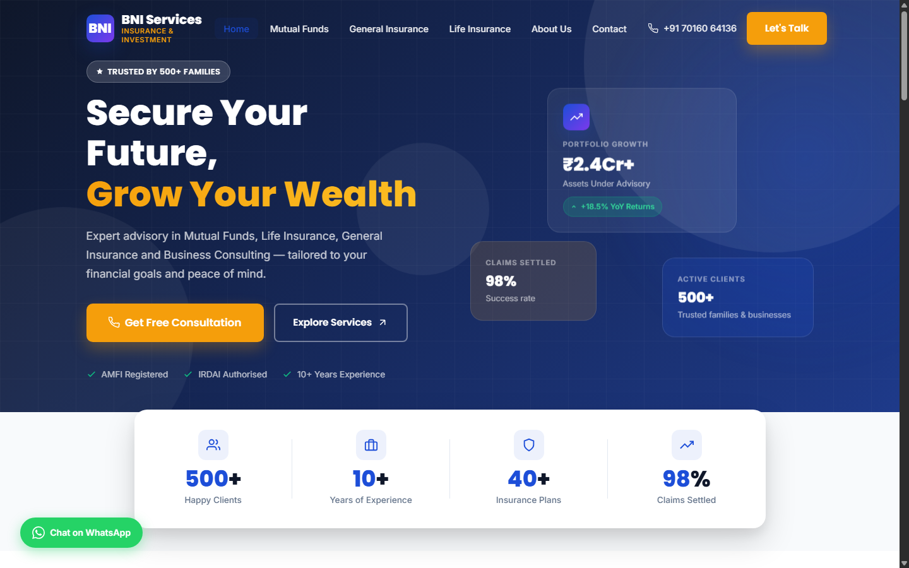

# BNI Services – Insurance & Investment Website

A fully responsive, multi-page static website built for **BNI Services**, a financial advisory firm based in Vadodara, Gujarat. The site covers their core offerings — Mutual Fund investments, Life Insurance, and General Insurance — and is designed to build trust with prospective clients through clean visuals, clear copy, and easy navigation.



---

## Live Preview

Open `index.html` in any browser — no build step or server needed.

---

## Pages

| File | Route | Description |
|---|---|---|
| `index.html` | `/` | Homepage — hero, stats, services overview, why choose us, testimonials, CTA |
| `about.html` | `/about` | Company story, team section, mission & values |
| `mutual-fund.html` | `/mutual-fund` | Mutual fund investment plans, SIP calculator info, fund types |
| `general-insurance.html` | `/general-insurance` | Health, motor, home & travel insurance detail page |
| `life-insurance.html` | `/life-insurance` | Term, ULIP, and endowment plan detail page |
| `contact.html` | `/contact` | Contact form, office address, call/WhatsApp links |

---

## Features

- **Zero dependencies** — pure HTML5, CSS3, and vanilla JavaScript. No frameworks, no npm, no build tools.
- **Responsive layout** — works on mobile, tablet, and desktop. Hamburger menu on small screens.
- **Page loader** — branded BNI loader animation on every page entry.
- **Scroll reveal animations** — sections and cards animate in as the user scrolls down.
- **Sticky navbar** — shrinks and adds a shadow on scroll, always accessible.
- **Real photography** — contextual images throughout (advisor meetings, health imagery, family photography) for a professional feel.
- **Consistent design system** — shared CSS variables for colors, typography, spacing, shadows, and border radii across all pages.
- **Accessible markup** — semantic HTML elements (`<nav>`, `<section>`, `<main>`, `<footer>`), ARIA labels on interactive elements, `alt` text on all images.

---

## Project Structure

```
bni-services/
├── index.html              # Homepage
├── about.html              # About Us page
├── mutual-fund.html        # Mutual Fund service page
├── general-insurance.html  # General Insurance service page
├── life-insurance.html     # Life Insurance service page
├── contact.html            # Contact page
├── assets/
│   └── preview.png         # README preview screenshot
├── css/
│   └── style.css           # All styles — variables, layout, components, utilities
└── js/
    └── main.js             # Page loader, navbar scroll, mobile menu, reveal animations
```

---

## Design Decisions

### Color Palette
| Token | Value | Used for |
|---|---|---|
| `--primary` | `#1d4ed8` | Primary buttons, active links, badges |
| `--primary-dark` | `#1e40af` | Hover states |
| `--accent` | `#f59e0b` | CTA button, highlight text |
| `--dark` | `#0f172a` | Backgrounds, headings |
| `--muted` | `#64748b` | Body text, captions |

### Typography
- **Headings** — `Syne` (Google Fonts) — geometric, modern
- **Body** — `Inter` (Google Fonts) — clean, highly legible at small sizes

### Layout
- 12-column grid via CSS custom grid utilities
- `max-width: 1280px` container, centered with horizontal padding
- Section vertical padding intentionally kept tight to avoid wasted whitespace

---

## Running Locally

No server needed for most features. Just open the file:

```bash
# macOS / Linux
open index.html

# Windows
start index.html
```

If you want to test with a local server (e.g., to avoid CORS issues with future enhancements):

```bash
# Python 3
python -m http.server 8000
# then visit http://localhost:8000
```

---

## Browser Support

Tested and working on:
- Chrome 120+
- Microsoft Edge 120+
- Firefox 121+
- Safari 17+

---

## License

This project was built for BNI Services, Vadodara. All rights reserved.
